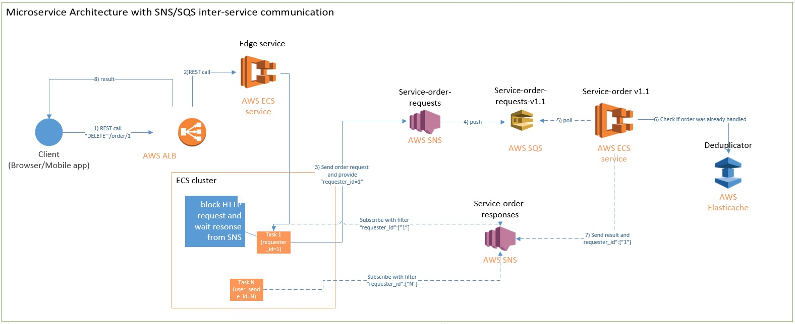

# Microservice Architecture in AWS with SNS/SQS inter-service communication.

The project demonstrates how to use asynchronous microservice communication using AWS SQS and SNS.

# Main flow

<ol type="1">
  <li>Client send "delete-order" request </li>
  <li>AWS ALB forwards request to EDGE SERVICE task(task 1) </li>
  <li>EDGE SERVICE task(task 1) blocks http call and send request to "Service-order-requests" SNS with marker "requester_id=1" </li>
  <li>SQS "Service-order-requests-v1.1" polls message from "Service-order-requests" SNS</li>
  <li>"Service-order v1.1" reads message from  SQS "Service-order-requests-v1.1" </li>
  <li>"Service-order v1.1" checks and mark as received message in Deduplicator(AWS Elasticache) </li>
  <li>"Service-order v1.1" deletes order and sends response to "Service-order-responses" with marker  "requester_id=1"</li>
  <li>EDGE SERVICE task(task 1) receives result, because it matches his filter. It gets blocked HTTP connection and add result back</li>
</ol>

# Benefits
<ol type="1">
  <li>Only one ALB for EDGE SERVICE. Don't need Eureka or another Service Discovery</li>
  <li>Back pressure</li>
  <li>No timeout/retries during inter-service communication </li>
  <li>Blue-green deployment support</li>
</ol>
